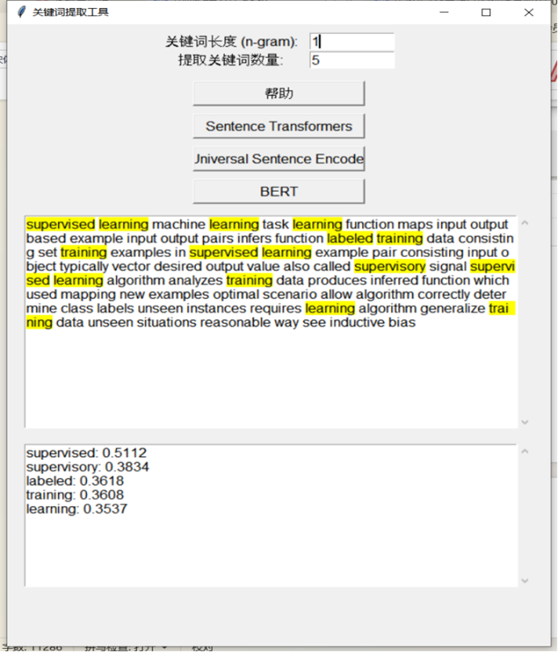

### 基于深度学习的关键词提取工具

---

#### 项目简介:

本项目是一款基于 TensorFlow 和多种 Transformer 模型的智能关键词提取桌面应用。用户可上传英文文本，程序会自动清洗数据，并利用 BERT、Universal Sentence Encoder (USE) 或 Sentence-Transformers 模型提取核心关键词，最终在界面中高亮显示。

#### 功能展示:

- **多模型选择**: 一键切换三种业界主流模型。
- **参数可调**: 自定义提取关键词的数量和长度。
- **结果高亮**: 直观地在原文中展示提取结果。

#### 项目运行:

* 根据env.yml构建conda环境
* 使用Jupyter lab启动,运行App_Final.ipynb

#### 关键文件概览:

* **App_Final.ipynb**
	* 这是项目的最终成品,集成了三种模型并提供和完整的GUI,包含完整功能
* **DataClean.ipynb**
	* 作为项目的数据预处理模块,负责读取原始文本数据，进行去除停用词、标点、URL等一系列清洗操作，为后续模型提供高质量的输入.

#### 探索过程:

* **CBOW_master.ipynb**
	* 早期尝试过从零训练语言模型但止步于词向量的准备,后意识到个人能力无法支撑而放弃.
* **App_Test.ipynb**
	* 项目的技术选型阶段。在此文件中，我对多种模型（BERT, Sentence-Transformers, Universal Sentence Encoder）进行了系统的横向对比，最终验证了App_Final.ipynb中所采用的技术方案